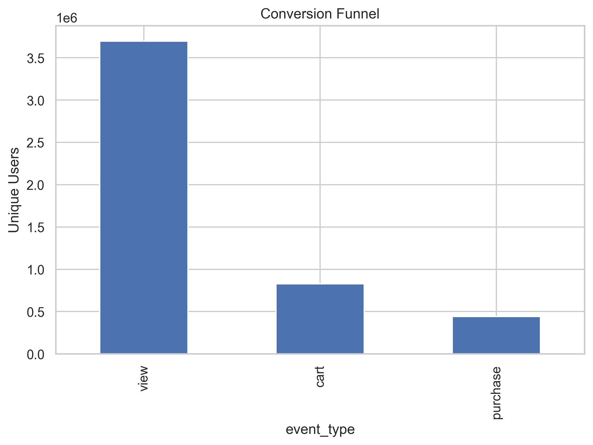
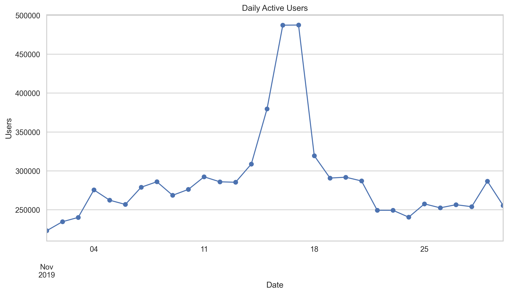
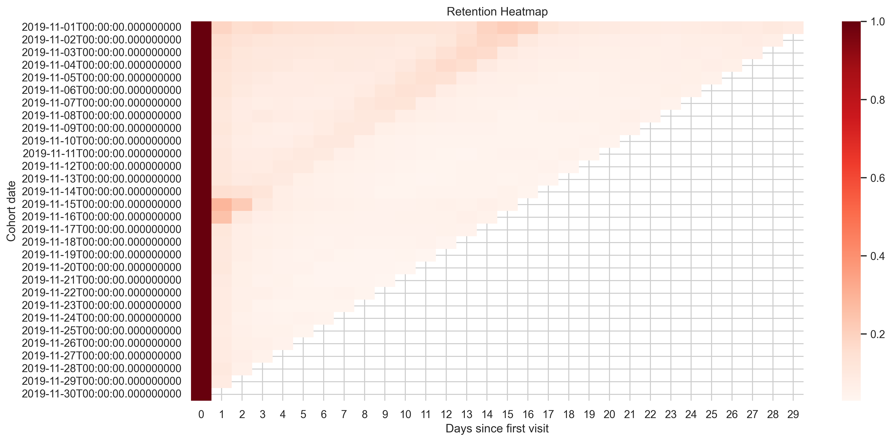
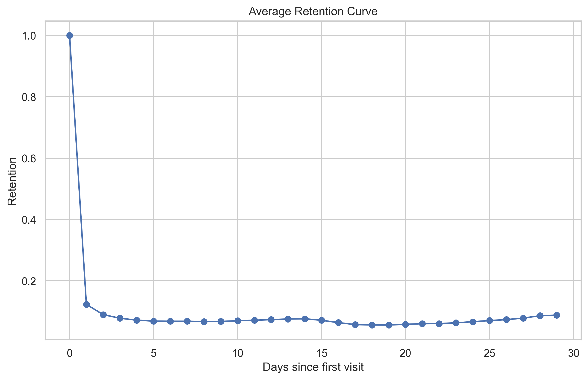
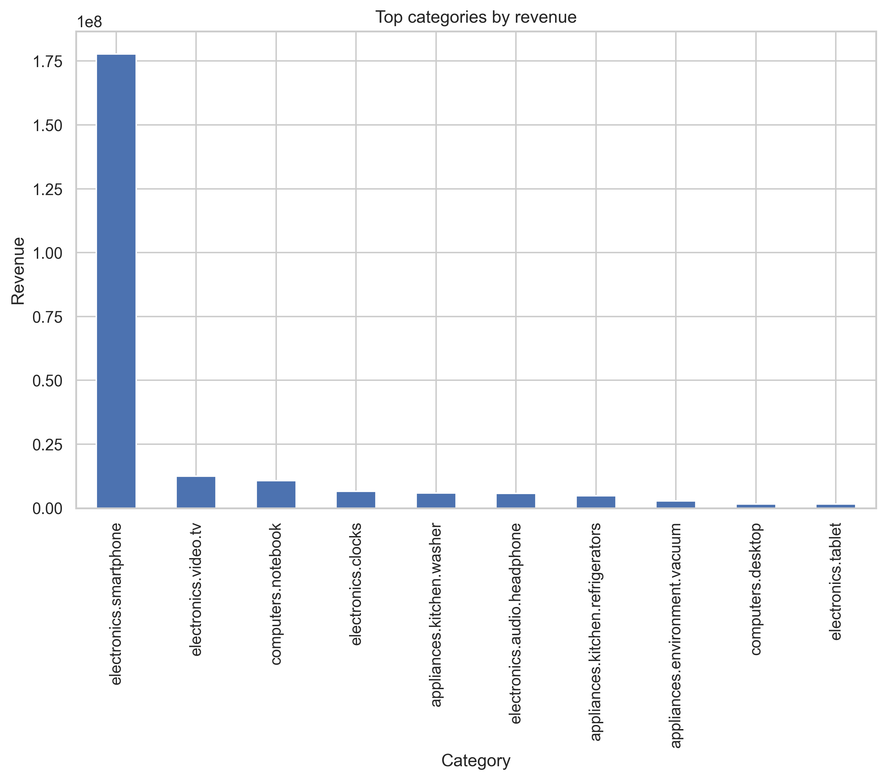
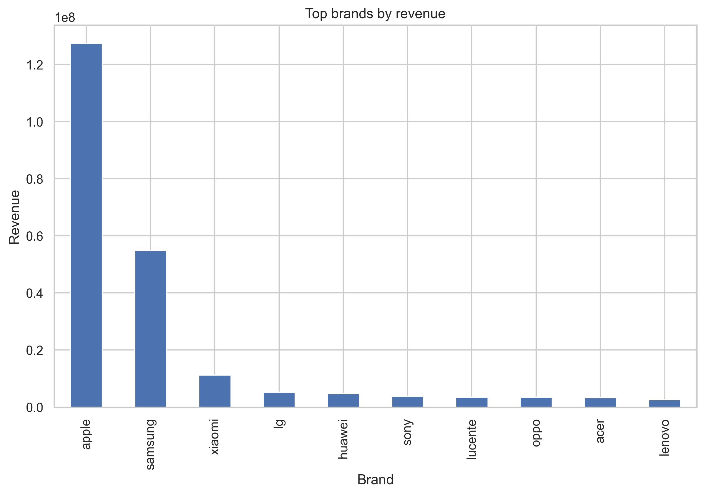

# Анализ поведения пользователей e-commerce платформы

## Описание проекта
В рамках проекта проведён анализ поведения пользователей на e-commerce платформе на основе датасета с событиями пользователей.
Данные содержат информацию о действиях пользователей:
* просмотр товара (view)
* добавление в корзину (cart)
* покупка (purchase)

Общий объём данных:
* 67 млн событий
* ~4.7 млн пользователей
* период: ноябрь 2019

Цель анализа — изучить поведение пользователей, ключевые продуктовые метрики и выявить закономерности взаимодействия с платформой.

---

# Используемые инструменты
* Python
* pandas
* matplotlib
* seaborn
* Jupyter Notebook

---

# Конверсионная воронка
Анализ воронки пользовательских действий:
* просмотр товара
* добавление в корзину
* покупка

### Метрики
* View → Cart: 22.35%
* Cart → Purchase: 48.41%

Это означает, что примерно каждый пятый просмотр товара приводит к добавлению в корзину, а почти половина пользователей, добавивших товар в корзину, совершают покупку.

### Визуализация

---

# DAU (Daily Active Users)
Для оценки активности пользователей была рассчитана метрика DAU — количество уникальных пользователей в день.

### Наблюдения
В середине месяца наблюдается значительный рост активности пользователей (16–17 ноября), что может быть связано с:
* маркетинговой кампанией
* распродажей
* рекламной активностью

### Визуализация

---

# Когортный анализ и Retention
Для анализа удержания пользователей был проведён когортный анализ.
Когорты формировались по дате первого визита пользователя.
Retention показывает долю пользователей, которые возвращаются на платформу спустя определённое количество дней.

### Основные метрики
* Day 1 retention: 12.31%
* Day 7 retention: 6.81%

---

# Retention heatmap
Тепловая карта позволяет увидеть динамику удержания пользователей по когортам.

---

# Кривая удержания пользователей
Средняя кривая retention показывает, как быстро пользователи перестают возвращаться на платформу.

---

# Анализ выручки
Была рассчитана дневная выручка платформы.

### Визуализация

---

# ARPU
Показывает среднюю выручку, которую приносит один пользователь платформы.
Total revenue: 275194890.5
Total users: 3696117
ARPU: 74.46

# Анализ товаров

Также был проведён анализ категорий и брендов, приносящих наибольшую выручку.

---

# Топ категорий по выручке

---

# Топ брендов по выручке

---

# Основные выводы

1. Конверсия из просмотра товара в добавление в корзину составляет около 22%.
2. Почти половина пользователей, добавивших товар в корзину, совершают покупку.
3. Наблюдается всплеск пользовательской активности в середине ноября.
4. Выручка распределена неравномерно — отдельные категории и бренды генерируют большую часть продаж.

